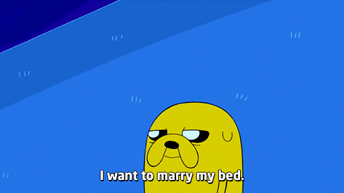

# PRUEBA
aqui a ver como se ve un gif si se ve.

## Índice
- [Sección 1](#seccion-1)
- [Sección 2](#seccion-2)
- [Conclusión](#conclusion)

## Sección 1 [Volver al índice](#índice)
Aquí va el contenido...

## Sección 2
[Volver al índice](#índice)
Más contenido...

## Conclusión

Fin del documento.
[Volver al índice](#índice)

!Onda senoidal animada

Se supone que asi si

