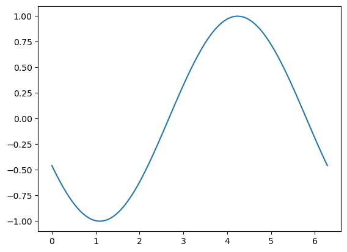

# PRUEBA
aqui a ver como se ve un gif si se ve.

## Índice
| Sección 1 | Sección 6 |
|-----------|-----------|
| [Introducción](#introducción) | [Ejemplos Avanzados](#ejemplos-avanzados) |
| [Conceptos Básicos](#conceptos-básicos) | [Pruebas y Debugging](#pruebas-y-debugging) |
| [Instalación](#instalación) | [Optimizaciones](#optimizaciones) |
| [Configuración](#configuración) | [Conclusión](#conclusión) |

## Sección 1 [Volver al índice](#índice)
Aquí va el contenido...

## Sección 2
[Volver al índice](#índice)
Más contenido...

## Conclusión

Fin del documento.
[Volver al índice](#índice)

!Onda senoidal animada

Se supone que asi si

