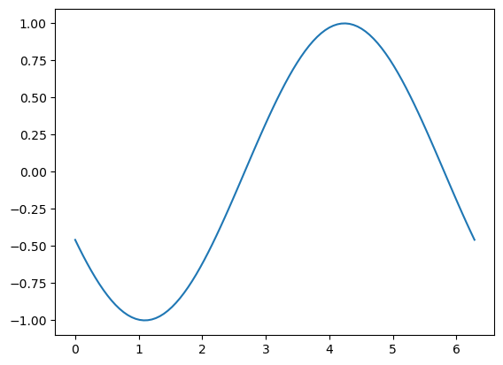

# Índice
- [Sección 1](#Sección-1)
- [Sección 2](#Sección-2)
- [Conclusión](#Conclusión)

## Sección 1
[Volver al índice](#índice)
Aquí va el contenido...

| No. | Tarea | Estado | Prioridad | Tutor |
|----|------------------------------------------|------------|------------|-------------------------------|
| 1  | Búsqueda del camino mínimo | En progreso | Alta | Marin Lujak |
| 2  | Operations Research: Optimization Algorithms | En progreso | Alta | |
| 3  | Discrete Optimization | En progreso | Alta | |
| 4  | Advanced Algorithm and Complexity | Pendiente | Alta | |
| 5  | Algorithms on Graphs | Pendiente | Alta | |
| 6  | Curso de Python | En progreso | Alta | |
| 7  | Leer trabajo: Centrality Measures for Evacuation: Finding Agile Evacuation Routes | Finalizado | Alta | |
| 8  | Sesión introducción BBDD | Finalizado | Alta | María Cristina Rodríguez Sánchez |
| 9  | Ver qué datos almacenar en la base de datos | Pendiente | Alta | |
| 10 | Echar un vistazo a la documentación de Optimización de BBDD: migración de la antigua a una nueva | Repetir? | Alta | |
| 11 | Analizar la estructura de la base de datos | Repetir? | Alta | |
| 12 | Definir e implementar la estructura de la base de datos | Pendiente | Alta | |
| 13 | [PostgreSQL](https://www.postgresql.org/) | Pendiente | Pendiente | |
| 14 | Resumen + objetivos + diagrama de flujo | Pendiente | Pendiente | |

## Sección 2
[Volver al índice](#índice)
Más contenido...

<table>
    <tr>
        <th>No.</th>
        <th>Tarea</th>
        <th>Estado</th>
        <th>Prioridad</th>
        <th>Tutor</th>
    </tr>
    <tr>
        <td>1</td>
        <td>Búsqueda del camino mínimo</td>
        <td>En progreso</td>
        <td>Alta</td>
        <td rowspan="7">Marin Lujak</td>
    </tr>
    <tr><td>2</td><td>Operations Research: Optimization Algorithms</td><td>En progreso</td><td>Alta</td></tr>
    <tr><td>3</td><td>Discrete Optimization</td><td>En progreso</td><td>Alta</td></tr>
    <tr><td>4</td><td>Advanced Algorithm and Complexity</td><td>Pendiente</td><td>Alta</td></tr>
</table>

<table border="1">
    <tr>
        <th>No.</th>
        <th style="width: 400px;">Tarea</th>
        <th>Estado</th>
        <th>Prioridad</th>
        <th>Tutor</th>
    </tr>
    <tr>
        <td>1</td>
        <td>Búsqueda del camino mínimo</td>
        <td>En progreso</td>
        <td>Alta</td>
        <td rowspan="7">Marin Lujak</td>
    </tr>
    <tr><td>2</td><td>Operations Research: Optimization Algorithms</td><td>En progreso</td><td>Alta</td></tr>
    <tr><td>3</td><td>Discrete Optimization</td><td>En progreso</td><td>Alta</td></tr>
    <tr><td>4</td><td>Advanced Algorithm and Complexity</td><td>Pendiente</td><td>Alta</td></tr>
    <tr><td>5</td><td>Algorithms on Graphs</td><td>Pendiente</td><td>Alta</td></tr>
    <tr><td>6</td><td>Curso de Python</td><td>En progreso</td><td>Alta</td></tr>
    <tr><td>7</td><td>Leer trabajo: Centrality Measures for Evacuation: Finding Agile Evacuation Routes</td><td>Finalizado</td><td>Alta</td></tr>
    
<table border="1">
    <tr>
        <th>No.</th>
        <th>Tarea</th>
        <th>Estado</th>
        <th>Prioridad</th>
        <th>Tutor</th>
    </tr>
    <tr>
        <td>8</td>
        <td>Sesión introducción BBDD</td>
        <td>Finalizado</td>
        <td>Alta</td>
        <td rowspan="5">María Cristina Rodríguez Sánchez</td>
    </tr>
    <tr><td>9</td><td>Ver qué datos almacenar en la base de datos</td><td>Pendiente</td><td>Alta</td></tr>
    <tr><td>10</td><td>Echar un vistazo a la documentación de Optimización de BBDD</td><td>Repetir?</td><td>Alta</td></tr>
    <tr><td>11</td><td>Analizar la estructura de la base de datos</td><td>Repetir?</td><td>Alta</td></tr>
    <tr><td>12</td><td>Definir e implementar la estructura de la base de datos</td><td>Pendiente</td><td>Alta</td></tr>
</table>

<table border="1">
    <tr>
        <th>No.</th>
        <th style="width: 400px;">Tarea</th>
        <th>Estado</th>
        <th>Prioridad</th>
        <th>Tutor</th>
    </tr>
    <tr>
        <td>1</td>
        <td>Búsqueda del camino mínimo</td>
        <td>En progreso</td>
        <td>Alta</td>
        <td rowspan="7">Marin Lujak</td>
    </tr>
    <tr><td>2</td><td>Operations Research: Optimization Algorithms</td><td>En progreso</td><td>Alta</td></tr>
    <tr><td>3</td><td>Discrete Optimization</td><td>En progreso</td><td>Alta</td></tr>
    <tr><td>4</td><td>Advanced Algorithm and Complexity</td><td>Pendiente</td><td>Alta</td></tr>
    <tr><td>5</td><td>Algorithms on Graphs</td><td>Pendiente</td><td>Alta</td></tr>
    <tr><td>6</td><td>Curso de Python</td><td>En progreso</td><td>Alta</td></tr>
    <tr><td>7</td><td>Leer trabajo: Centrality Measures for Evacuation: Finding Agile Evacuation Routes</td><td>Finalizado</td><td>Alta</td></tr>
    
<tr>
        <td>8</td>
        <td>Sesión introducción BBDD</td>
        <td>Finalizado</td>
        <td>Alta</td>
        <td rowspan="5">María Cristina Rodríguez Sánchez</td>
    </tr>
    <tr><td>9</td><td>Ver qué datos almacenar en la base de datos</td><td>Pendiente</td><td>Alta</td></tr>
    <tr><td>10</td><td>Echar un vistazo a la documentación de Optimización de BBDD: migración de la antigua a una nueva</td><td>Repetir?</td><td>Alta</td></tr>
    <tr><td>11</td><td>Analizar la estructura de la base de datos</td><td>Repetir?</td><td>Alta</td></tr>
    <tr><td>12</td><td>Definir e implementar la estructura de la base de datos</td><td>Pendiente</td><td>Alta</td></tr>

<tr><td>13</td><td><a href="https://www.postgresql.org/">PostgreSQL</a></td><td>Pendiente</td><td>Pendiente</td><td></td></tr>
    <tr><td>14</td><td>Resumen + objetivos + diagrama de flujo</td><td>Pendiente</td><td>Pendiente</td><td></td></tr>
</table>

## Conclusión
[Volver al índice](#índice)
Fin del documento.
